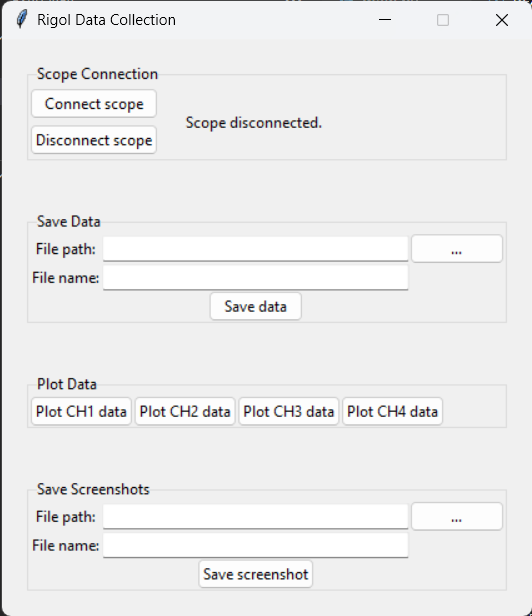

# rigol-data-collector

This is a Python (3.11) app used to collect data from Rigol DS1000Z series oscilloscopes. Most of the code for interacting with the scope is from [AlexZettler](https://github.com/AlexZettler/Rigol1000z/tree/master) on GitHub. I made a few changes to their code to make it work. I also used some code from [amosborne](https://github.com/amosborne/rigol-ds1000z/tree/main) for visa stuff.

I don't guarantee that this program will work at all for anyone else, but I don't see why it shouldn't. If you find problems, feel free to submit a PR, but note that I don't plan on actively maintaining this.

## preparing for use

To use this project, first clone the repository and enter the root directory of the cloned repo.

This project was only tested with Python 3.11. It may work with other versions of Python 3, but YMMV. It uses numpy and PyVISA. If you have [Poetry](https://python-poetry.org/), run `poetry install` to get the required dependencies. If you don't have Poetry, you can run `pip install -r requirements.txt` in the root directory of the repo to install the dependencies.

## using

To run the app, run the script `./rigol_data_collector/main.py`. If you're using Poetry, you can do this with `poetry run python ./rigol_data_collector/main.py`. Otherwise, run the file in whatever way is appropriate based on how you installed the dependencies.

When opened, you should see something like the window shown below:

Connect the USB cable to the oscilloscope, then click on "Connect scope".

To save data, add the path to the directory where the data should be saved to the text box labelled "File path". You can press the button next to that text box to select a directory using a GUI.

Input the desired name of the data file in the box labelled "File name". The program will automatically add the .csv extension if you don't. *If you already have a file with the same name at the selected location, it will be overwritten when saving data.* To save data to the selected location, click "Save data".

Saving a screenshot of the oscilloscope works almost identically. Screenshots are saved as `.png` files. (The scope and library support other formats, but I left it as the default.)

If you need to communicate with the scope from a different program, you can release the VISA resource by clicking "Disconnect scope". It can be reconnected using the "Connect scope" button.
